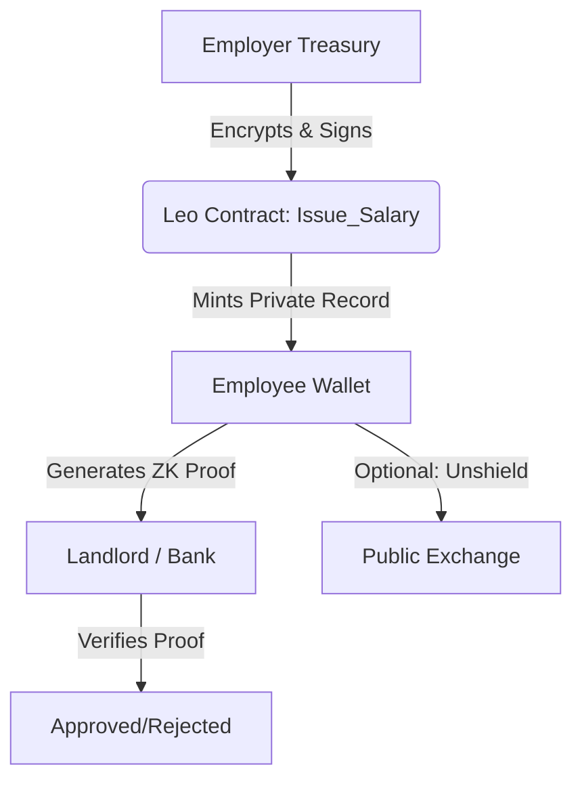

# 🤫 SilentPay
### *Privacy-First Payroll on Aleo*


> **"Pay your team in crypto without broadcasting their salaries to the world."**

---

## 🧐 The Problem
In traditional DeFi payrolls (like Sablier or Superfluid), **transparency is a bug, not a feature.**
* **Employer Risk:** Competitors can see your entire treasury runway.
* **Employee Risk:** Every salary payment is public. A bad actor can calculate exactly how much an employee earns and target them.
* **Real World Block:** No serious company will move their payroll on-chain if it means doxing their entire financial structure.

## 👻 The Solution: SilentPay
**SilentPay** is a decentralized payroll protocol built on **Aleo**. It uses Zero-Knowledge (ZK) cryptography to turn salary payments into private, encrypted records.

**With SilentPay:**
1.  **Employers** send funds privately. The transaction is verified, but the *amount* and *recipient* are hidden from the public explorer.
2.  **Employees** receive a "Paycheck Record." They can prove to third parties (like landlords) that they earn a specific income **without revealing their wallet address or transaction history.**

---

## 🛠 Tech Stack

* **Smart Contracts:** [Leo](https://developer.aleo.org/leo/) (Aleo's ZK Language)
* **Backend:** Rust (Actix-Web) + PostgreSQL (Employee mapping & scheduling)
* **Frontend:** Next.js + Aleo SDK
* **Proof Generation:** Aleo SnarkVM

---

## 🔥 Key Features

### 1. Private Payroll Execution
Unlike public blockchains where `Transfer(A, B, 1000 USDC)` is visible, SilentPay mints a private `Paycheck` record.
* **Public View:** "Someone sent something to someone." (Encrypted)
* **Private View (Employer/Employee):** "Corp X sent 5,000 USDC to Alice."

### 2. ZK-Proof of Income (The "Killer Feature") 📄
Employees often struggle to get loans or rent apartments because they can't prove crypto income without revealing their private keys or full history.
* **SilentPay Feature:** Employees can generate a **ZK-Proof** that certifies: *"I have received > $50k in the last 12 months from a verified issuer"* returns `TRUE` or `FALSE`.
* **Result:** The landlord verifies the income **without ever seeing the salary amount.**

### 3. Compliance-Ready Treasury
Treasuries can manage payrolls without exposing their total assets to the public, preventing "whale watching" and front-running.

---

## 🏗 Architecture



### Core Leo Functions

* `transition issue_paycheck(...)`: Mints the private record.
* `view verify_income(...)`: The magic ZK circuit for income proof.
* `transition claim_salary(...)`: Consumes the record to unshield funds (if needed).

---

## 🚀 Getting Started

### Prerequisites

* [Leo Language](https://www.google.com/search?q=https://developer.aleo.org/leo/installation) installed
* [Rust](https://www.rust-lang.org/tools/install) installed
* An Aleo Wallet (Leo Wallet recommended)

### Installation

1. **Clone the repo:**
```bash
git clone [https://github.com/ayoubbuoya/silent-pay.git](https://github.com/ayoubbuoya/silent-pay.git)
cd silent-pay

```


2. **Build the Leo Contracts:**
```bash
cd contracts/silentpay
leo build

```


3. **Run the Backend (Rust):**
```bash
cd backend
cargo run

```


4. **Run the Frontend:**
```bash
cd frontend
npm install && npm run dev

```


---

## 🏆 Hackathon Context (For Judges)

This project was built specifically for the **Aleo Privacy Buildathon (Wave 2)** to address the **"Privacy Usage"** (40% score) criteria.

* **Privacy is Default, not optional:** The core value proposition *requires* privacy. A public version of this app would be useless.
* **Real Utility:** This solves a massive friction point for DAOs and Web3 companies.
* **Technical Depth:** Utilizes custom `Record` structures and `Mapping` views in Leo to manage state without revealing it.

---

## 🗺 Roadmap

* [x] **MVP:** Private Salary Issuance (Wave 2 Submission)